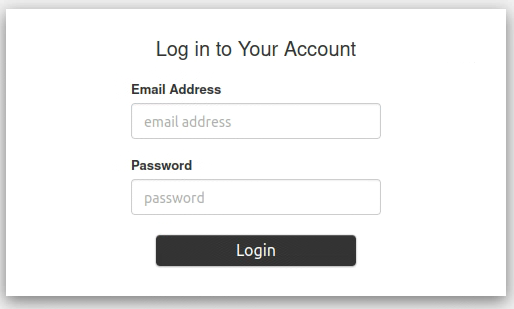
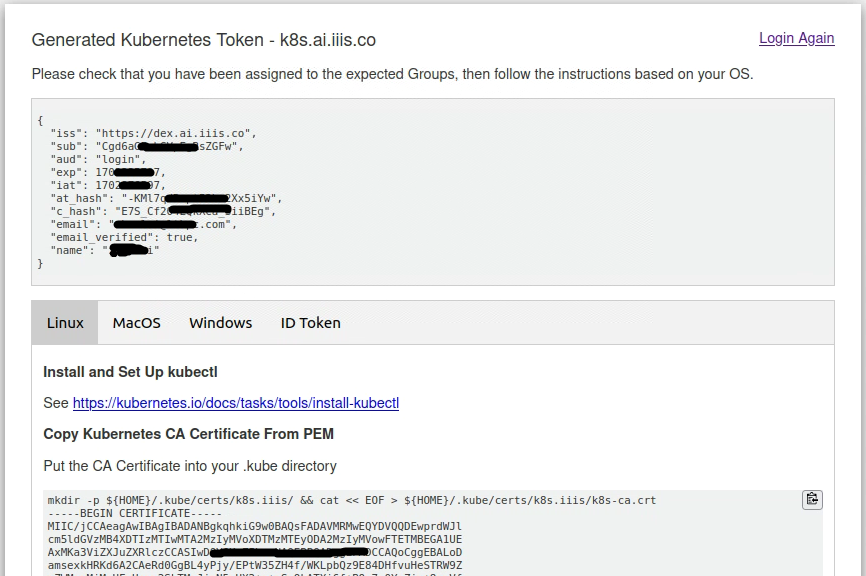
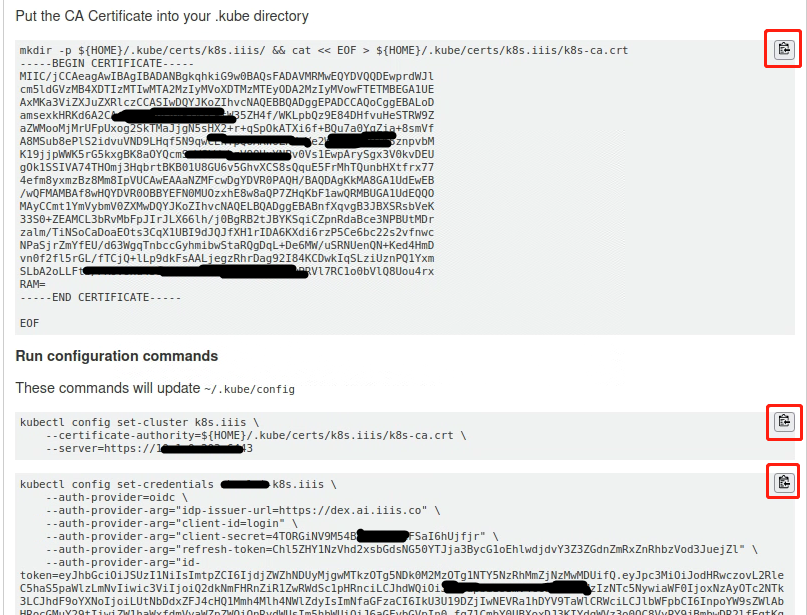
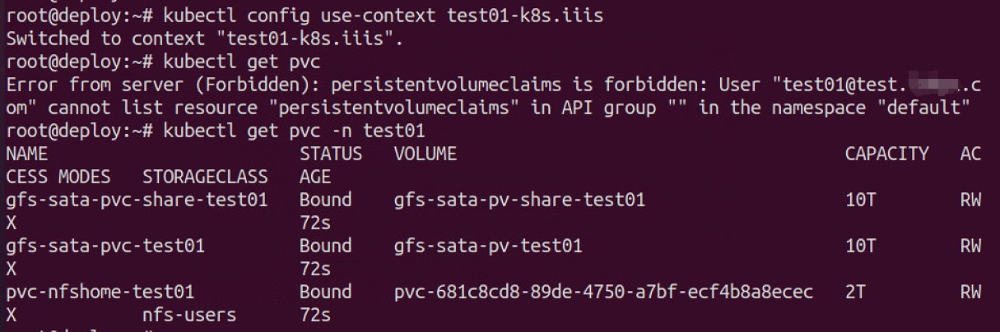
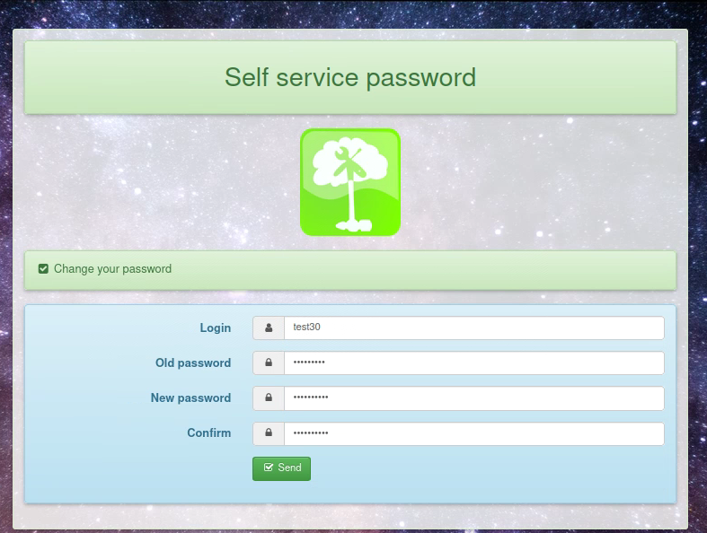
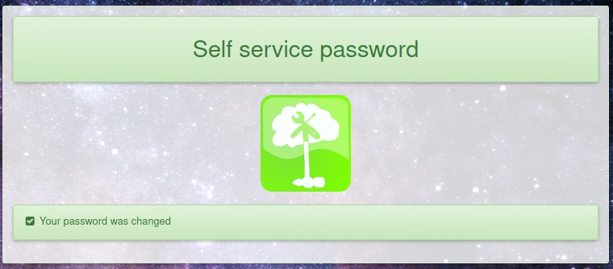

# ailab

- [ailab](#ailab)
  - [集群概况](#集群概况)
  - [获取访问权限](#获取访问权限)
    - [配置kubeconfig](#配置kubeconfig)
  - [使用K8S](#使用k8s)
  - [其他使用说明](#其他使用说明)
    - [修改账号密码](#修改账号密码)
    - [使用 VS Code 连接K8S远程调试](#使用-vs-code-连接k8s远程调试)
    - [私有容器镜像仓库](#私有容器镜像仓库)
      - [自定义镜像](#自定义镜像)
        - [信任集群 Harbor](#信任集群-harbor)
        - [制作镜像](#制作镜像)
          - [环境准备](#环境准备)
          - [编写 Dockerfile 制作镜像](#编写-dockerfile-制作镜像)
        - [从自定义镜像创建 Pod](#从自定义镜像创建-pod)


## 集群概况

本集群计算环境基于 K8S 搭建而成，硬件包括3台独立的 master 节点、28台 worker 节点和一台提供 NFS 服务的 NAS（网络存储服务器）。使用 Harbor 搭建私有镜像仓库，openLDAP 进行统一身份认证。通过统一的 kubeconfig 配置文件分发平台，用户也可以通过 [kubectl](https://kubernetes.io/docs/tasks/tools/install-kubectl-linux/) 以命令行的方式使用K8S集群。


|系统|登陆地址|功能|
|---|---|---|
|密码管理|https://auth.ai.iiis.co|账号修改密码。|
|Harbor|https://harbor.ai.iiis.co|私有容器镜像仓库|
|kubeconfig|https://login.ai.iiis.co|kubeconfig配置文件分发平台|

## 获取访问权限

在管理员已经为用户创建好账号的情况下， 用户需要确认是否已经满足下列三个条件

- 您使用的终端可以访问K8S集群，[连接集群的方法参考此文档](http://wiki.iiis.systems:9988/w/index.php/VPN_User_Guide)；
- 您的终端能够安装并正常运行 [kubectl](https://kubernetes.io/docs/tasks/tools/install-kubectl-linux/)；
- 您已经获取了访问K8S集群的用户名、用户账号关联邮箱和登录密码。

为了确保账号安全，强烈建议大家拿到账号后先 [修改密码](#修改账号密码)。

### 配置kubeconfig

用户基于 kubeconfig 通过命令行方式使用K8S，需要先在自己的终端设备配置好 kubeconfig。利用系统提供的 kubeconfig 信息（包含用户账户和 Token 等信息），可以在自己的终端利用 kubectl 对 K8S 集群中的资源进行访问。本节介绍如何获取和使用 kubeconfig。

用浏览器访问URL地址：https://login.ai.iiis.co ，会进入Login界面：



输入邮箱地址和密码即可登录。

>注：这里登录要使用 **邮箱地址**，而不是用户名或DN等。

进入kubeconfig信息页面，选择您使用的系统类型。

请按照您所使用的 kubectl 所在的操作系统进行选择。



接下来，要按照页面指示的顺序在您运行 kubectl 的命令行运行命令。

可以点击每条命令右上的复制图标来将命令复制到粘贴板。



所有指令执行完毕后，即可使用 kubectl 访问K8S中的资源。

>注：只能访问系统分配给用户个人命名空间（namespace，ns）下的资源，否则会提示缺失相关权限的错误。

以test01用户查看PVC为例，当不指定ns时，会使用默认的 "default" ns，而用户没有这个ns下的权限，所以会提示操作被禁止。指定ns为test01后就可以正常查看资源。




为了避免每次均输入命名空间参数，可以利用`alias`：

```bash
# .bashrc
alias kubectl="kubectl -n test01"  # test01为分配的namespace
```

## 使用K8S

在 K8S 集群中，管理员已经为每一位用户创建了与 UID 相同的命名空间ns。用户只在自己的 ns 中具有使用权限，因此所有操作都只能在自己的 ns 中完成。

用户可以直接使用 [kubectl](https://kubernetes.io/docs/tasks/tools/install-kubectl-linux/) 管理 k8s，而 helm 是 Kubernetes 的包管理器，helm的安装及使用方法可以参考[官方文档](https://helm.sh/docs/)。本仓库为用户提供了创建计算任务的 helm 模板，只需要将 values.yaml 文件中的内容按照自己账号和计算需求进行修改，即可使用helm创建计算任务。以本仓库中 test06 用户的 values.yaml 文件为例，在本项目的根路径使用下面的命令就可以创建一个副本数为 1 的 [Deployment](https://kubernetes.io/zh-cn/docs/concepts/workloads/controllers/deployment/)计算任务工作负载。

```
helm install test06-pytorch2.1.1 \
      --namespace=test06 \
      --values ./user/userchart/values.yaml \
      ./user/userchart
```

`user-test06`为helm部署的版本名（release），建议设置为自己的`UID+任务描述`的格式以方便后续维护管理。`--namespace=test06`指定了test06自己的用户ns，`--values ./user/userchart/values.yaml`为helm模板的各项变量提供了对应的值，最后`./user/userchart`是helm模板的路径位置。

在账号的初始状态，管理员为用户创建好了用于长期保存数据的[持久卷申领（PersistentVolumeClaim，PVC）](https://kubernetes.io/zh-cn/docs/concepts/storage/persistent-volumes/)。
- 挂载于容器内`/root`路径的NFS服务的PVC，用于存储文档及代码等小文件；
- 挂载于容器内`/gfshome`路径GFS的个人存储空间PVC，用于存储模型文件、数据集等大文件；
- 挂载于容器内`/share`路径GFS的共享空间PVC，用于存放和共享开源大模型、开源数据集等公共数据；

临时数据存放在宿主机本地的NVME硬盘中，挂载在容器内的`/scratch1`至`/scratch4`，PVC被删除后里面的数据也会被删除，请一定不要将需要持久化保存的重要数据放在这几个路径。

上面的helm模板中会自动挂载长期存储数据的三个PVC，并自动创建对应于`/scratch1`至`/scratch4`的四个临时数据存储PVC。


| 存储系统   | 写入速度 |
| ---------- | -------- |
| 宿主机NVME | 2.3GB/s  |
| GFS        | 1GB/s    |
| NFS        | 1GB/s    |


通过下面的命令删除计算任务

```
helm delete test06-pytorch2.1.1 --namespace=test06
```

该命令会自动删除容器和应于`/scratch1`至`/scratch4`的四个临时数据存储PVC，但不会删除长期存储数据的三个PVC。

values.yaml 文件的内容包括
- NameSpace：修改为自己的UID
- DeployName：建议用`UID+任务描述`的格式
- Label：Deployment的标签，建议用`容器镜像名+任务描述`的格式
- ContainerName：容器名，建议用`容器镜像名+任务描述`的格式
- ContainerImage：容器镜像地址
- Limits：容器的资源限制，注意所有的容器资源总和不能超过自己ns的quota
- NVMEStorage：`/scratch1`至`/scratch4`的四个临时数据存储PVC的大小
- UIDD：使用管理员分配的默认值，不能修改
- GIDD：使用管理员分配的默认值，不能修改

如果对helm chart功能及语法比较熟悉，也欢迎用户对模板进行修改或定制，并将成果分享给大家。

## 其他使用说明

### 修改账号密码

集群提供了一套简单的密码修改界面，用户可以修改自己账号的密码。

用浏览器访问URL地址 `https://auth.ai.iiis.co` 访问密码修改界面。界面如下图：


在界面上填写用户名（界面上的Login字段）、原密码（Old password字段）、新密码（New password字段），并重复输入一次新密码（Confirm字段），点击【Send】按钮，即可完成账号密码修改。


### 使用 VS Code 连接K8S远程调试

使用 [VS Code](https://code.visualstudio.com/) 可以远程 debug 集群中创建的 POD。这里我们给出一个简单的教程，更多的信息请自行查阅 [Kubernetes 文档](https://kubernetes.io/zh/docs/concepts/services-networking/service/)与 [VS Code 文档](https://code.visualstudio.com/docs/azure/kubernetes)。

首先我们需要在 VS Code 中安装`Kubernetes`插件、`Docker`插件、`Remote Container`插件、`Bridge to Kubernetes`插件：


使用`ctrl + shift + P`（Mac 下`command + shift + P`）选择`Kubernetes: Use Namespace`


输入自己的 namespace 后就能访问自己namespace下的资源了。以连接一个 POD 作为示例：


这样将会自动连接一个 VS Code 远程窗口，之后的开发就和本地类似了。

### 私有容器镜像仓库

#### 自定义镜像

我们可以在集群里从自定义镜像拉起 POD，以支持快速的实验环境配置。自定义镜像的思路是**在`ubuntu-tensorflow`、`ubuntu-pytorch`或`orion-client-2.4.2`的基础上，配置自己的环境**。

##### 信任集群 Harbor

自定义镜像需要从 Harbor 拉取，因此我们需要在 Docker 中添加对集群 Harbor 的信任。在Mac下用 Docker Desktop 可以直接在客户端里加入`insecure-registries`项：


若未使用 Docker Desktop，则在`/etc/docker/daemon.json`中添加（若该文件不存在则创建）：

```json
{

  "insecure-registries": [
    "harbor.ai.iiis.co"
  ]
}
```

添加完毕后，重启 Docker。

##### 制作镜像

制作镜像的方式有基于 Dockerfile 和 `docker commit`命令两种形式。我们这里推荐基于 Dockerfile 方式，`docker commit`方式请参考[官方文档](https://docs.docker.com/engine/reference/commandline/commit/)。

> **_NOTE:_** 在[这里](https://github.com/iiisthu/gpupool/tree/master/examples/build_example)可以找到我们在这一节所使用的例子。

我们假设在`ubuntu-pytorch`的基础上，我们还需要配置一系列环境：

1. 安装一系列 Python 依赖库，在`requirements.txt`中指明。
2. 将某个 Python 包的 Git 仓库放入镜像，并从仓库源码安装该 Python 包。
3. 创建`workspace`工作目录。

其他的操作可以参考这几个任务。我们假设我们在`build`目录下工作，我们使用[`navdeep-G/samplemod`](https://github.com/navdeep-G/samplemod)作为 Python Package 的例子。

###### 环境准备

假设我们需要 Python 支持一系列的库，例如画图的`matplotlib`和交互式的`jupyter`等，我们将这些写在`build`目录下：

```txt
# requirements.txt
numpy >= 1.19
matplotlib
pandas >= 1.0
jupyter
```

我们也希望pod能安装我们自己的一个私有代码仓库中的某个 Python Package，我们以[`navdeep-G/samplemod`](https://github.com/navdeep-G/samplemod)为例：

```bash
# PWD: build/
git clone https://github.com/navdeep-G/samplemod
```

整个工作目录为：

```
build
├── samplemod
│   ├── docs/
│   ├── sample/
│   ├── tests/
│   ├── .gitignore
│   ├── LICENSE
│   ├── MANIFEST.in
│   ├── Makefile
│   ├── README.rst
│   ├── requirements.txt
│   └── setup.py
└── requirements.txt
```

###### 编写 Dockerfile 制作镜像

我们从`harbor.ai.iiis.co/library/`下的镜像出发，安装`requirements.txt`中的依赖，并安装数据。我们这里不赘述[ Dockerfile 的语法](https://docs.docker.com/engine/reference/builder/)。实例的 Dockerfile 如下：

```docker
# Dockerfile
FROM harbor.ai.iiis.co/library/ubuntu-pytorch:1.5.0
COPY . build
RUN pip install -r build/requirements.txt && cd build/samplemod; pip install . && mkdir -p workspace && rm -rf build
```

> **_NOTE:_** 这里用单行命令是为了让制作后的镜像历史中不会存在build文件夹（类似于git，即使删去的文件也会在历史中存储，以备未来可能的恢复）。

之后利用`docker`按照 Dockerfile 制作镜像，并标记为`sample:v0`：

```bash
docker build . -t sample:v0
```

最后确认镜像已经成功创建：

```
$ docker images | grep sample
sample          v0         707ab1c88146        30 seconds ago       11.3GB
```

##### 从自定义镜像创建 Pod

从刚才我们制作的镜像创建 Pod 分为两步，首先需要将镜像推送到集群镜像仓库 Harbor，再从 Harbor 对应的镜像拉起 Pod。

在连接 VPN 后，访问[harbor.ai.iiis.co](http://harbor.ai.iiis.co)，用户名密码同 VPN。

> **_NOTE:_** 注意这里的用户名不需要加入域名信息，即只需要`username`而不是Email。

连接到 Harbor 后新建项目：


> **_NOTE:_** 注意这里需要勾选公开，原因是私有集群物理机的 docker 并没有登录用户个人的 Harbor 账户，因此无法拉取私有仓库中的镜像。

假设我们的项目名为 zhangsan，则我们之后的镜像均要 push 到`harbor.ai.iiis.co/zhangsan/`下，首先 tag 我们做好的镜像：

```bash
docker tag sample:v0 harbor.ai.iiis.co/zhangsan/sample:v0
```

之后将镜像 push 到 Harbor 中，我们需要先在 docker 中登录我们在 Harbor上的账号：

```txt
$ docker logout harbor.ai.iiis.co
Removing login credentials for harbor.ai.iiis.co
$ docker login harbor.ai.iiis.co
Username: zhangsan
Password:
Login Succeeded
```

最后将镜像推送到 Harbor 中：

```bash
docker push harbor.ai.iiis.co/zhangsan/sample:v0
```

创建好镜像后，拉起 Pod 流程和标准镜像一样。