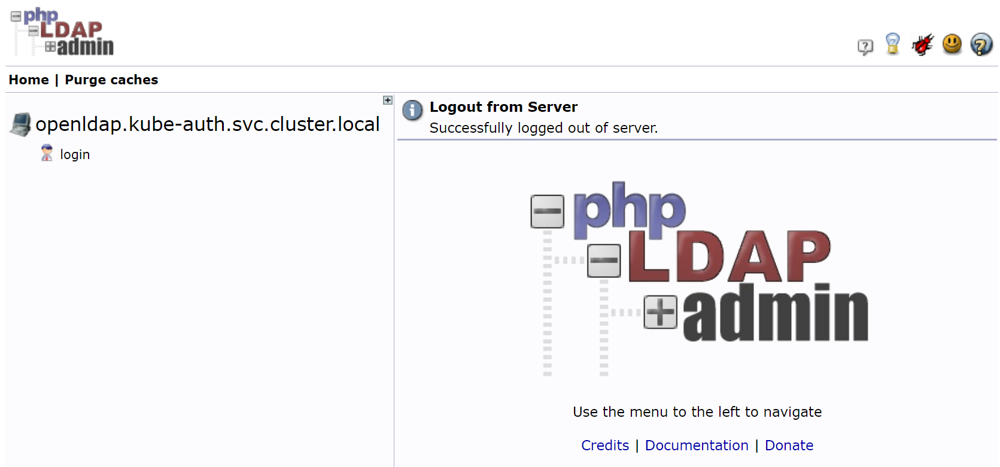
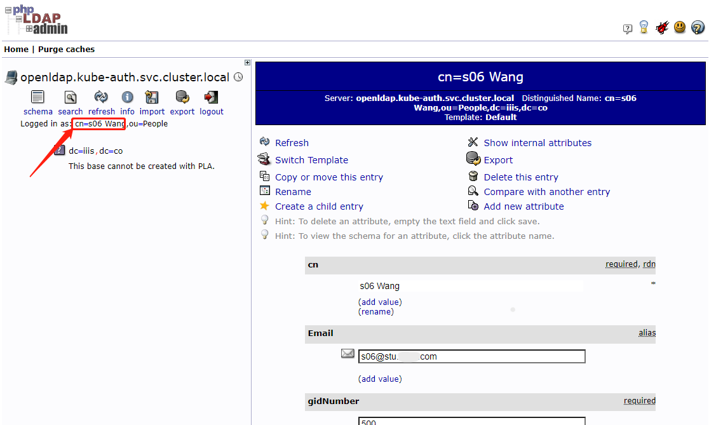
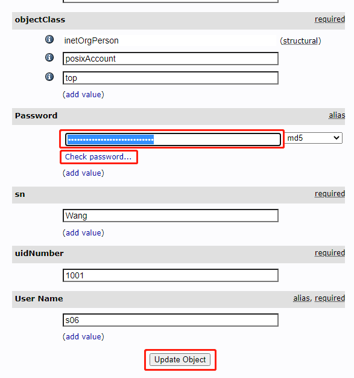
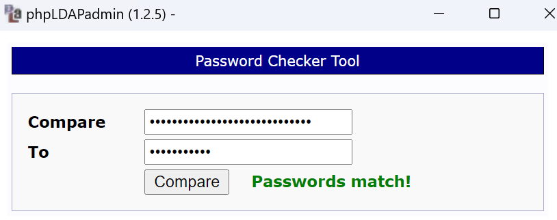
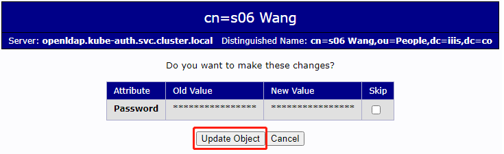

# ailab

## 集群概况

本集群计算环境基于 K8S 搭建而成，硬件包括3台独立的 master 节点、28台 worker 节点和一台提供 NFS 服务的 NAS（网络存储服务器）。使用 Harbor 搭建私有镜像仓库，openLDAP 进行统一身份认证。通过统一的 kubeconfig 配置文件分发平台，用户也可以通过 [kubectl](https://kubernetes.io/docs/tasks/tools/install-kubectl-linux/) 以命令行的方式使用K8S集群。


|系统|登陆地址|功能|
|---|---|---|
|openLDAP|https://ldap.ai.iiis.co|查看账号基本信息，修改密码。|
|Harbor|https://harbor.ai.iiis.co|私有容器镜像仓库|
|kubeconfig|https://login.ai.iiis.co|kubeconfig配置文件分发平台|

## 使用说明

在管理员已经为用户创建好账号的情况下， 用户需要确认是否已经满足下列三个条件

- 您使用的终端可以访问K8S集群；
- 您的终端能够安装并正常运行 [kubectl](https://kubernetes.io/docs/tasks/tools/install-kubectl-linux/)；
- 您已经获取了访问K8S集群的用户名、用户账号关联邮箱和登录密码。

### 修改账号密码

集群提供了一套简单的LDAP操作界面（即phpLDAPAdmin），用户可以登录上去，查看或修改用户自身信息。

用浏览器访问URL地址 `https://ldap.ai.iiis.co`访问上述操作界面。

首先会进入登录界面：



  

点击左侧的【login】按钮，右侧会出现登录页面：


  

登录此界面要使用用户在LDAP中的DN（Distinguished Name），
对于名字为张三的同学来说，DN应该为

`cn=San Zhang,ou=Students,ou=People,dc=iiis,dc=co` 。

输入DN和用户密码，点击【Authenticate】按钮即可登录。
  

登录后，在页面左侧点击用户自己的cn名称（如下图所示），页面右侧即可显示用户信息：



  

在右侧用户信息向下翻，可以找到Password栏目，此处可以修改用户密码：



  

填写密码信息后，可以点击密码输入框下面的【Check password...】链接，会弹出对话框，检查输入密码是否正确。



  

验证密码正确性后，关闭对话框，可点击【Update Ojbect】按钮，提交更改。会出现确认页面，点击【Update Object】按钮，即修改完成。



  

修改完成用户密码后，会退出登录。

### 配置kubeconfig

用户基于 kubeconfig 通过命令行方式使用K8S，需要先在自己的终端设备配置好 kubeconfig。利用系统提供的 kubeconfig 信息（包含用户账户和 Token 等信息），可以在自己的终端利用 kubectl 对 K8S 集群中的资源进行访问。本节介绍如何获取和使用 kubeconfig。

用浏览器访问URL地址：https://login.ai.iiis.co ，会进入Login界面：


输入邮箱地址和密码即可登录。

>注：这里登录要使用 **邮箱地址**，而不是用户名或DN等。

进入kubeconfig信息页面，选择您使用的系统类型

请按照您所使用的 kubectl 所在的操作系统进行选择。


接下来，要按照页面指示的顺序在您运行 kubectl 的命令行运行命令

可以点击每条命令右上的复制图标来将命令复制到粘贴板。


所有指令执行完毕后，即可使用 kubectl 访问K8S中的资源。

>注：只能访问系统分配给用户个人ns下的资源，否则会提示缺失相关权限的错误。

以test01用户查看PVC为例，当不指定ns时，会使用默认的 "default" ns，而用户没有这个ns下的权限，所以会提示操作被禁止。指定ns为test01后就可以正常查看资源。


## 用户

在 K8S 集群中，管理员已经为每一位用户创建了与 UID 相同的命名空间（namespace，ns）。用户只在自己的 ns 中具有使用权限，因此所有操作都只能在自己的 ns 中完成。

用户可以直接使用 [kubectl](https://kubernetes.io/docs/tasks/tools/install-kubectl-linux/) 管理 k8s，而 helm 是 Kubernetes 的包管理器，helm的安装及使用方法可以参考[官方文档](https://helm.sh/docs/)。本仓库为用户提供了创建计算任务的 helm 模板，只需要将 values.yaml 文件中的内容按照自己账号和计算需求进行修改，即可使用helm创建计算任务。以本仓库中 test06 用户的 values.yaml 文件为例，在本项目的根路径使用下面的命令就可以创建一个副本数为 1 的 [Deployment](https://kubernetes.io/zh-cn/docs/concepts/workloads/controllers/deployment/)计算任务工作负载。

```
helm install test06-pytorch2.1.1 \
      --namespace=test06 \
      --values ./user/userchart/values.yaml \
      ./user/userchart
```

`user-test06`为helm部署的版本名（release），建议设置为自己的`UID+任务描述`的格式以方便后续维护管理。`--namespace=test06`指定了test06自己的用户ns，`--values ./user/userchart/values.yaml`为helm模板的各项变量提供了对应的值，最后`./user/userchart`是helm模板的路径位置。

在账号的初始状态，管理员为用户创建好了用于长期保存数据的[持久卷申领（PersistentVolumeClaim，PVC）](https://kubernetes.io/zh-cn/docs/concepts/storage/persistent-volumes/)。
- 挂在于容器内`/root`路径的NFS服务的PVC，用于存储文档及代码等小文件；
- 挂在于容器内`/gfshome`路径GFS的个人存储空间PVC，用于存储模型文件、数据集等大文件；
- 挂在于容器内`/gfshare`路径GFS的共享空间PVC，用于存放和共享开源大模型、开源数据集等公共数据；

临时数据存放在宿主机本地的NVME硬盘中，挂载在容器内的`/scratch1`至`/scratch4`，PVC被删除后里面的数据也会被删除，请一定不要将需要持久化保存的重要数据放在这几个路径。

上面的helm模板中会自动挂载长期存储数据的三个PVC，并自动创建对应于`/scratch1`至`/scratch4`的四个临时数据存储PVC。

通过下面的命令删除计算任务

```
helm delete test06-pytorch2.1.1 --namespace=test06
```

该命令会自动删除容器和应于`/scratch1`至`/scratch4`的四个临时数据存储PVC，但不会删除长期存储数据的三个PVC。

values.yaml 文件的内容包括
- NameSpace：修改为自己的UID
- DeployName：建议用`UID+任务描述`的格式
- Label：Deployment的标签，建议用`容器镜像名+任务描述`的格式
- ContainerName：容器名，建议用`容器镜像名+任务描述`的格式
- ContainerImage：容器镜像地址
- Limits：容器的资源限制，注意所有的容器资源总和不能超过自己ns的quota
- NVMEStorage：`/scratch1`至`/scratch4`的四个临时数据存储PVC的大小
- UIDD：使用管理员分配的默认值，不能修改
- GIDD：使用管理员分配的默认值，不能修改

如果对helm chart功能及语法比较熟悉，也欢迎用户对模板进行修改或定制，并将成果分享给大家。
