# 管理员使用说明

## 用户管理

集群提供了LDAP的操作界面（phpLDAPAdmin），用于管理员进行用户账号信息的管理操作。

### 关于用户组织架构的约定

由于LDAP是一个应用场景范围比较广泛的规范。应用于K8S集群单点登录场景时，要对其中的用户组织架构附加一定的限制，才能顺畅地实现多个身份验证相关服务的打通。

期望的组织架构如下图所示。
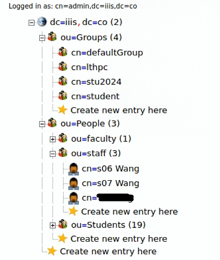

组织架构的约定如下：
1. 在根节点（dc=iiis,dc=co）下，创建两个ou（Organisational Unit），名为Groups、People；
2. Group下必须一个或多个类型为posixGroup的组（如上图中的defaultGroup、student组），用于创建用户账户时填写gid字段；
3. 组都建在ou=Group节点下；除第2条所述的个别posixGroup外，其他分组使用groupOfUniqueNames类型；
4. 用户都建在ou=People节点下，类型为User Account对象；必须为用户增加Email字段，并确保该字段取值唯一；
5. （可选）可以在People下面创建多个子ou来对用户进行分类管理（如上图中的faculty/staff/Students三个ou）；
6. 通过修改组（groupOfUniqueNames类型）的member属性实现用户和组的关联，一个用户可以隶属于多个groupOfUniqueNames组。

### 操作说明

在浏览器上登录LDAP管理界面（phpLDAPAdmin）的URL地址：`https://ldap.ai.iiis.co/`。
管理员用户名：`cn=admin,dc=iiis,dc=co`


登录后，界面如下，用于操作的界面元素分为三部分：*左上操作按钮栏*、*左侧组织架构*、*右侧操作页面*。

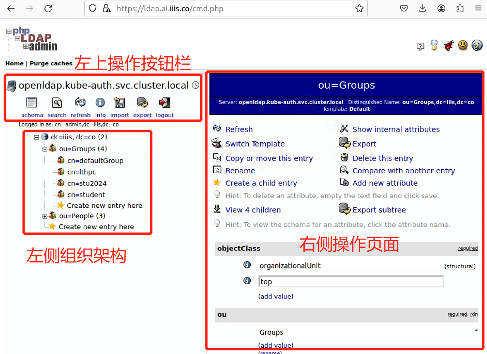

#### 1、创建ou（Groups和People）

1）在*左侧组织架构*上选中根节点（dc=iiis,dc=co），右侧操作页面上选择【Create a child entry】操作：

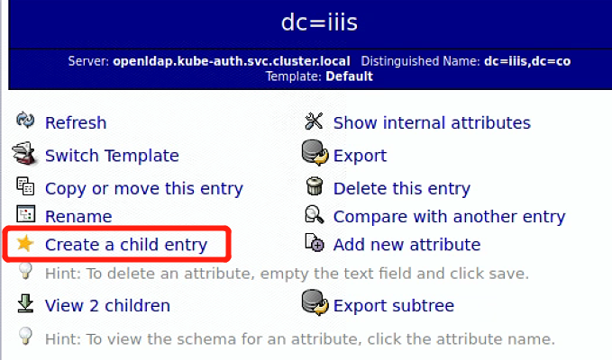

2）选择【Generic: Organisational Unit】模版：

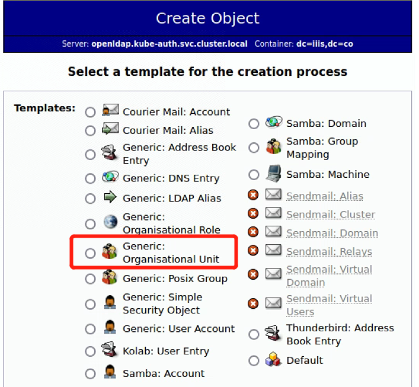

3）填写ou名称（People或Groups），点击【Create Object】按钮：

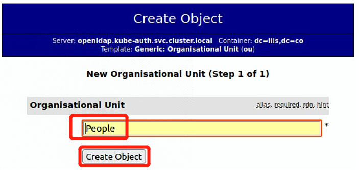

4）确认页面中，点击【Commit】按钮：

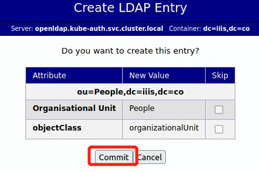

经过以上操作一个ou就创建完成了。可按照上述步骤再继续创建其他ou。

**注：在People下创建子ou的过程类似，只要在第（1）步中选择`ou=People`节点作为父节点进行操作即可。**


#### 2、创建一个Posix Group用户组

由于创建用户账户时，需要选择一个Posix Group的Group ID（gid），因此须创建一个Posix Group对象。**这项操作只做一次即可。**
操作方式如下。

1）左侧组织架构上选中”ou=Groups“，右侧操作页面选择【Create a child entry】操作：

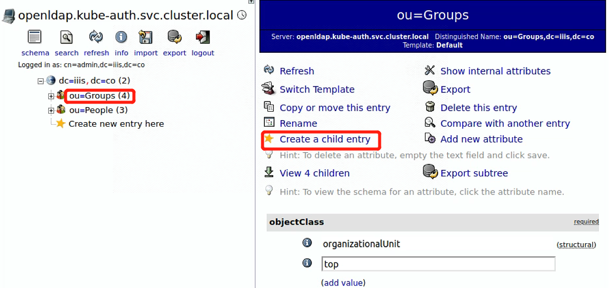

2）选择【Generic: Posix Group】模版


3）填写组名。系统会自动生成GID Number：

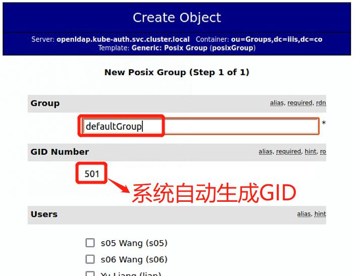

4）确认页面中点击【Commit】按钮，完成创建。


#### 3、创建用户账户（常用操作）

**这里创建的用户账户信息将可用于K8S集群kubeconfig的获取和相关系统的单点登录。**

1）左侧组织架构上选中ou=People或者其子ou（例如下图的ou=staff），右侧操作页面选择【Create a child entry】操作

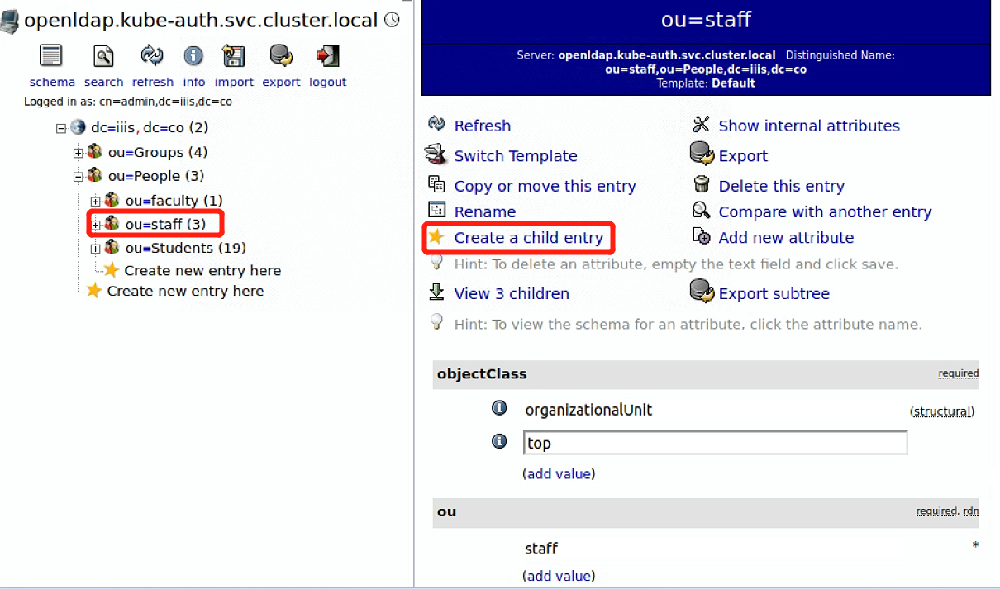

2）选择“Generic: User Account”模版类型：

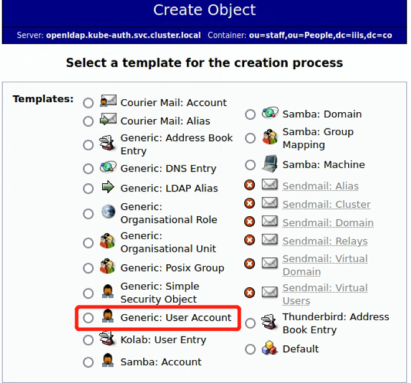

3）填写用户信息，点击【Create Object】按钮

- 其中GID Number字段可通过下拉菜单选择任意一个Posix Group的名称。

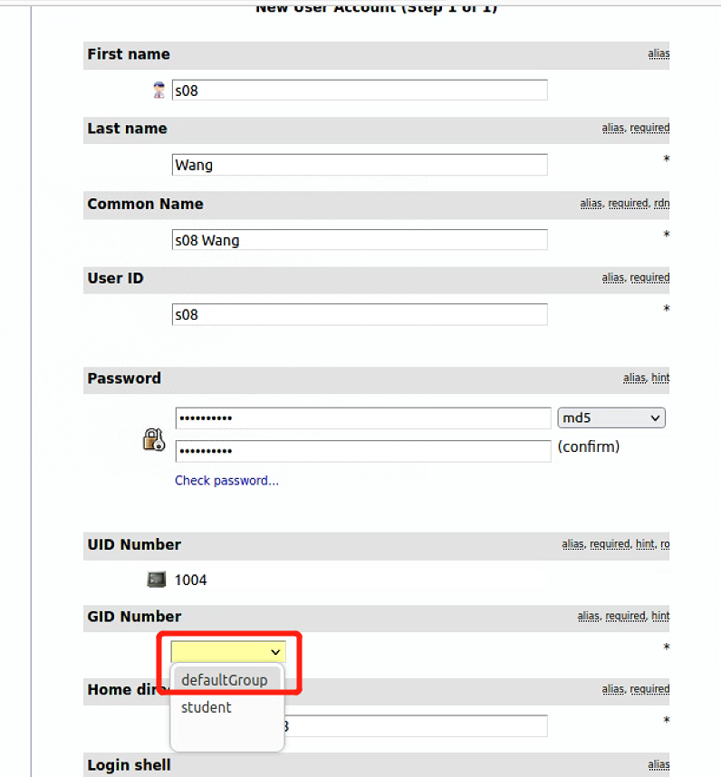


4）在确认页中点击【Commit】按钮。

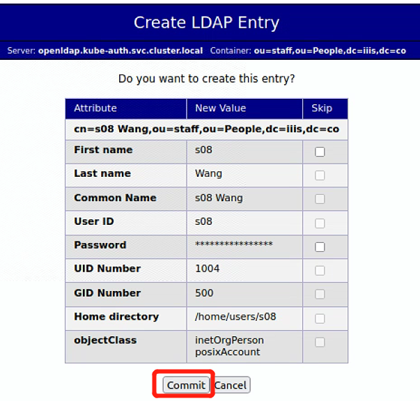


5）增加Email属性并填写用户email地址。
左侧组织架构上选中用户cn，右侧页面选择【Add new attribute】操作：

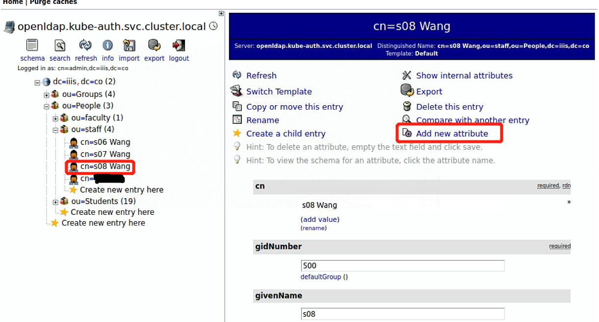

页面会出现Add Attribute的栏目，在下拉菜单中选择Email这个属性：

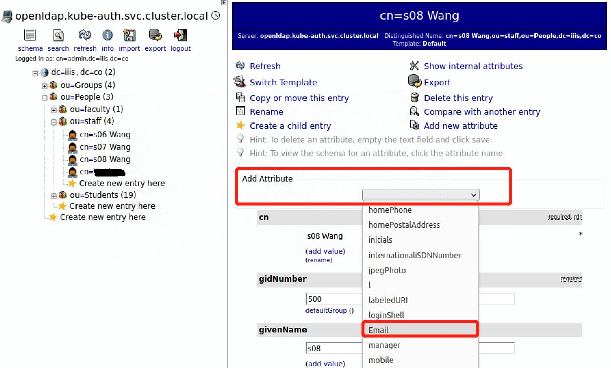

填写用户的Email地址：

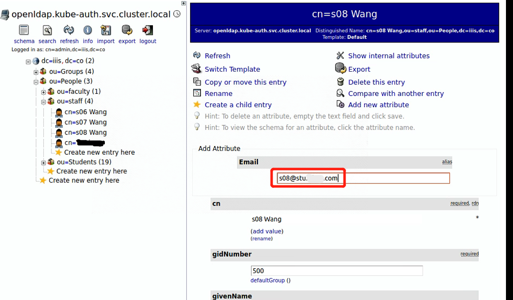

点击右侧操作页面下方的【Update Object】按钮。
并在确认页面点击【Update Object】按钮。

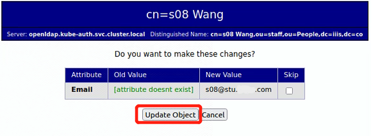


可以在用户账号的页面上看到已经添加了Email信息：
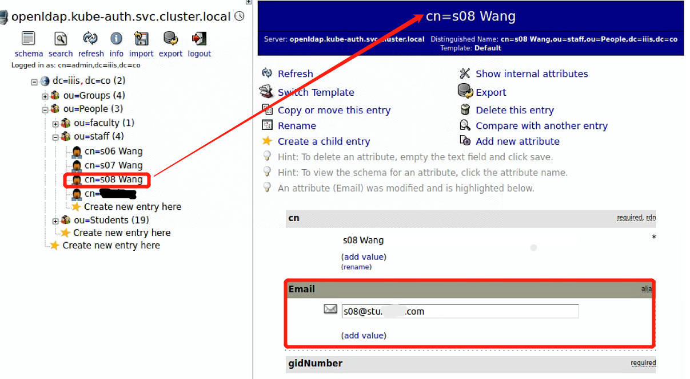


#### 4、创建用户组

这里创建的用户组与用户账户是**多对多**的关系，即一个组可以包含多个用户，同时一个用户可以归属于多个组。从扩展性考虑，用户组采用groupOfUniqueNames类型（也可采用groupOfNames类型）。

操作方式如下。

1）左侧组织架构上选中ou=Groups，右侧操作页面选择【Create a child entry】操作；

2）模版类型选择default - groupOfUniqueNames，如下面两个图所示：


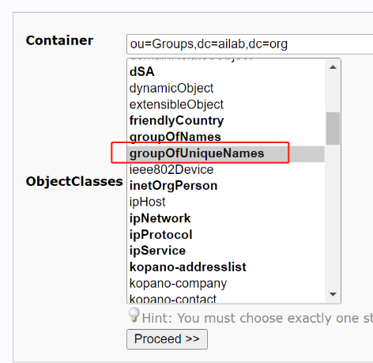

3）进入了用户组的编辑页面，填写三个必填字段即可：
- RDN选择cn；
- cn填写组名；
- uniqueMember选择一个属于改组的用户账户即可。
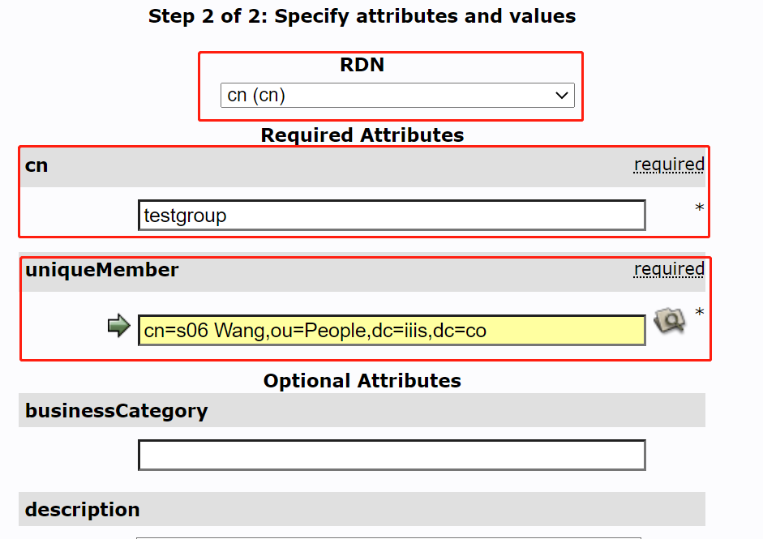

后续提交、确认即可完成组的创建。


#### 5、修改组成员

在用户组上可以通过修改uniqueMember字段加入用户。同一个用户可以归属到多个组。

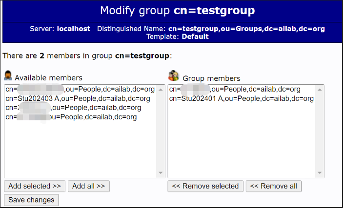

### K8S创建命名空间、PVC及授权

`adduser_dir.sh` 脚本会为K8S集群安装本地硬盘卷的驱动器。并根据用户信息明细文件为每个用户创建命名空间、授权用户在自己命名空间中具有USER权限，在GFS为用户创建个人数据路径并创建对应的PVC，设置每个命名空间的资源限制。

用户明细文件以 `username.txt` 为例，文件内容包括 `uid,mail,uidNumber,gidNumber` 四列内容，没有表头。

```
$ cat username.txt

test01,test01@test.lthpc.com,2001,500
test02,test02@test.lthpc.com,2002,500
test03,test03@test.lthpc.com,2003,500

```

切换到本项目的 `admin` 路径下，执行脚本自动创建用户的相关资源。
```
$ bash adduser_dir.sh username.txt
```
脚本运行完成之后，`username.txt` 中的用户就可以通过kubeconfig使用K8S集群了。`username.txt` 文件需要保留，在删除用户时需要用到。

### K8S 删除用户及相关资源

`deluser_dir.sh` 脚本可以自动删除用户在GFS的个人PVC、NFS中的个人PVC和个人命名空间中的所有资源以及命名空间本身。

切换到本项目的 `admin` 路径下，执行脚本自动删除用户的相关资源。

```
$ bash deluser_dir.sh username.txt
```